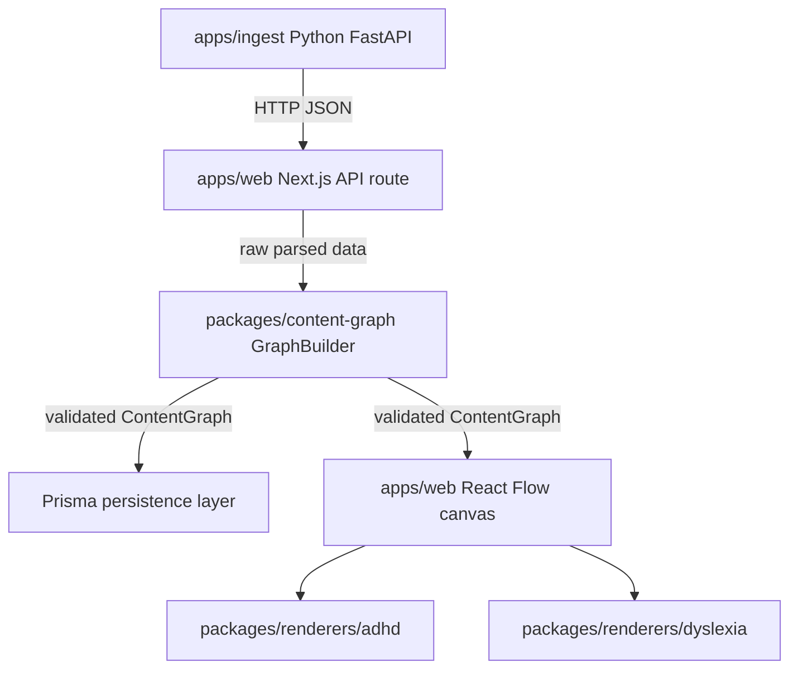

# Design Document: Content Graph Data Model

## Overview

The `content-graph` package is the foundational data layer of Lattice. It defines the canonical in-memory and persisted representation of learning material extracted from multiple source types. The package lives at `packages/content-graph/` and is consumed by every other layer of the system — the ingest pipeline, the interactive canvas, and the profile renderers.

The design centers on three entity types:

- **EvidenceAnchor** — a pointer to an exact location in a source document
- **ConceptNode** — a single discrete learning idea, always backed by at least one EvidenceAnchor
- **RelationshipEdge** — a directed, typed semantic connection between two ConceptNodes

These entities are composed into a **ContentGraph** container. A **GraphBuilder** API provides a safe, fluent construction path that enforces all structural invariants at build time rather than at render time. All entities are validated with **Zod schemas** at every input boundary, and the inferred TypeScript types are exported alongside the schemas so consumers get runtime validation and compile-time safety from a single source of truth.

The most critical invariant is **Agency Guardrail Rule 1 — the Provenance Gate**: no ConceptNode may exist or render without at least one valid EvidenceAnchor. This is enforced at the schema level, at the builder level, and proven by property-based tests using **fast-check**.

---

## Architecture

### Package placement

```
packages/
  content-graph/
    src/
      schemas/
        evidence-anchor.schema.ts   # EvidenceAnchor Zod schema + type
        concept-node.schema.ts      # ConceptNode Zod schema + type
        relationship-edge.schema.ts # RelationshipEdge Zod schema + type
        content-graph.schema.ts     # ContentGraph Zod schema + type
      builder/
        graph-builder.ts            # Immutable GraphBuilder class
      prisma/
        schema.prisma               # Prisma models (SQLite / Postgres)
      index.ts                      # Public barrel export
    tests/
      provenance-gate.pbt.test.ts   # fast-check property-based tests
      schemas.unit.test.ts          # Zod schema unit tests
      builder.unit.test.ts          # GraphBuilder unit tests
    package.json
    tsconfig.json
```

### Dependency flow



### Validation layers

Every piece of data passes through three sequential validation layers before it can be used:

1. **Schema validation** (Zod) — structural and type correctness, field constraints, discriminated union variants
2. **Builder validation** — cross-entity invariants (depth progression, dangling edge references, source registration)
3. **Persistence validation** (Prisma) — referential integrity at the database level

This layered approach means that by the time a `ContentGraph` reaches the renderer, it is guaranteed to be structurally sound.

---

## Components and Interfaces

### EvidenceAnchor

```typescript
// Discriminated union for source location
type Locator =
  | { type: "pdf"; page: number }           // page >= 1
  | { type: "video"; timestampSeconds: number } // timestampSeconds >= 0
  | { type: "image"; region: { x: number; y: number; width: number; height: number } }; // all >= 0

interface EvidenceAnchor {
  id: string;          // UUID
  sourceId: string;    // UUID — references a registered source document
  locator: Locator;
  excerpt: string;     // 1–300 characters
}
```

**Design decision**: The `locator` is a discriminated union rather than a flat set of nullable fields. This makes the type self-documenting and ensures that a PDF locator cannot accidentally carry a video timestamp. Zod's `z.discriminatedUnion("type", [...])` maps directly to this shape.

### ConceptNode

```typescript
type Depth = "overview" | "standard" | "deep";

interface ConceptNode {
  id: string;                          // UUID
  title: string;                       // 1–120 characters
  definition: string;                  // non-empty
  expandedExplanation?: string;        // 1–800 characters when present
  depth: Depth;
  tags: string[];                      // may be empty
  evidenceAnchors: [EvidenceAnchor, ...EvidenceAnchor[]]; // non-empty tuple (Provenance Gate)
}
```

**Design decision**: `evidenceAnchors` is typed as a non-empty tuple `[EvidenceAnchor, ...EvidenceAnchor[]]` rather than `EvidenceAnchor[]`. This encodes the Provenance Gate at the TypeScript type level — the compiler rejects an empty array at the call site, before Zod even runs. Zod's `z.array(...).min(1)` enforces the same constraint at runtime.

### RelationshipEdge

```typescript
type EdgeType = "causes" | "contains" | "contradicts" | "exemplifies" | "depends-on" | "elaborates";

interface RelationshipEdge {
  id: string;              // UUID
  fromNodeId: string;      // UUID — must exist in ContentGraph.nodes
  toNodeId: string;        // UUID — must exist in ContentGraph.nodes
  type: EdgeType;
  confidence: number;      // [0, 1] inclusive
  evidenceAnchors: EvidenceAnchor[]; // may be empty unless type === "contradicts"
}
```

**Design decision**: The `"contradicts"` edge type has a stricter invariant than other edge types — it requires at least two EvidenceAnchors with **distinct** `sourceId` values. This enforces Agency Guardrail Rule 2 (No Authoritative Generation): a contradiction must be evidenced by two independent sources, not two excerpts from the same document. This constraint is implemented as a Zod `.superRefine()` on the edge schema.

### ContentGraph

```typescript
interface ContentGraph {
  id: string;                              // UUID
  nodes: Record<string, ConceptNode>;      // keyed by node UUID
  edges: Record<string, RelationshipEdge>; // keyed by edge UUID
  sourceIds: string[];                     // UUIDs of all contributing sources
}
```

**Design decision**: `nodes` and `edges` are `Record<string, ...>` maps rather than arrays. This gives O(1) lookup by ID, which is critical for the canvas renderer (React Flow needs to resolve node references during layout) and for the builder's dangling-reference check.

### GraphBuilder

```typescript
type Result<T, E> = { ok: true; value: T } | { ok: false; error: E };

class GraphBuilder {
  addSource(sourceId: string): GraphBuilder;
  addNode(node: ConceptNodeInput): Result<GraphBuilder, ValidationError>;
  addEdge(edge: RelationshipEdgeInput): Result<GraphBuilder, ValidationError>;
  build(): Result<ContentGraph, ValidationError[]>;
}
```

**Design decision**: The builder is **immutable** — every method that returns a `GraphBuilder` returns a new instance. This prevents accidental mutation of intermediate states and makes the builder safe to use in concurrent server action contexts. The `Result<T, E>` type (a simple discriminated union) is used instead of throwing exceptions, so callers are forced to handle errors explicitly.

**Design decision**: `addNode` and `addEdge` validate eagerly (at call time) rather than deferring all validation to `build()`. This gives the ingest pipeline fast feedback on individual entities without having to assemble a full graph first. `build()` then runs a final cross-entity validation pass (dangling references, source registration).

---

## Data Models

### Zod Schema Definitions

#### EvidenceAnchor Schema

```typescript
const LocatorSchema = z.discriminatedUnion("type", [
  z.object({ type: z.literal("pdf"), page: z.number().int().min(1) }),
  z.object({ type: z.literal("video"), timestampSeconds: z.number().min(0) }),
  z.object({
    type: z.literal("image"),
    region: z.object({
      x: z.number().min(0),
      y: z.number().min(0),
      width: z.number().min(0),
      height: z.number().min(0),
    }),
  }),
]);

const EvidenceAnchorSchema = z.object({
  id: z.string().uuid(),
  sourceId: z.string().uuid(),
  locator: LocatorSchema,
  excerpt: z.string().min(1).max(300),
});

type EvidenceAnchor = z.infer<typeof EvidenceAnchorSchema>;
```

#### ConceptNode Schema

```typescript
const DepthSchema = z.enum(["overview", "standard", "deep"]);

const ConceptNodeSchema = z.object({
  id: z.string().uuid(),
  title: z.string().min(1).max(120),
  definition: z.string().min(1),
  expandedExplanation: z.string().min(1).max(800).optional(),
  depth: DepthSchema,
  tags: z.array(z.string()),
  evidenceAnchors: z.array(EvidenceAnchorSchema).min(1), // Provenance Gate
});

type ConceptNode = z.infer<typeof ConceptNodeSchema>;
// Note: evidenceAnchors is typed as [EvidenceAnchor, ...EvidenceAnchor[]] via z.array().min(1)
```

#### RelationshipEdge Schema

```typescript
const EdgeTypeSchema = z.enum([
  "causes", "contains", "contradicts", "exemplifies", "depends-on", "elaborates",
]);

const RelationshipEdgeSchema = z.object({
  id: z.string().uuid(),
  fromNodeId: z.string().uuid(),
  toNodeId: z.string().uuid(),
  type: EdgeTypeSchema,
  confidence: z.number().min(0).max(1),
  evidenceAnchors: z.array(EvidenceAnchorSchema),
}).superRefine((edge, ctx) => {
  if (edge.type === "contradicts") {
    const distinctSources = new Set(edge.evidenceAnchors.map(a => a.sourceId));
    if (edge.evidenceAnchors.length < 2 || distinctSources.size < 2) {
      ctx.addIssue({
        code: z.ZodIssueCode.custom,
        message: "A 'contradicts' edge requires at least two EvidenceAnchors from distinct sources.",
        path: ["evidenceAnchors"],
      });
    }
  }
});

type RelationshipEdge = z.infer<typeof RelationshipEdgeSchema>;
```

#### ContentGraph Schema

```typescript
const ContentGraphSchema = z.object({
  id: z.string().uuid(),
  nodes: z.record(z.string().uuid(), ConceptNodeSchema),
  edges: z.record(z.string().uuid(), RelationshipEdgeSchema),
  sourceIds: z.array(z.string().uuid()),
}).superRefine((graph, ctx) => {
  // Dangling edge reference check
  for (const [edgeId, edge] of Object.entries(graph.edges)) {
    if (!graph.nodes[edge.fromNodeId]) {
      ctx.addIssue({ code: z.ZodIssueCode.custom,
        message: `Edge ${edgeId}: fromNodeId ${edge.fromNodeId} not found in nodes.`,
        path: ["edges", edgeId, "fromNodeId"] });
    }
    if (!graph.nodes[edge.toNodeId]) {
      ctx.addIssue({ code: z.ZodIssueCode.custom,
        message: `Edge ${edgeId}: toNodeId ${edge.toNodeId} not found in nodes.`,
        path: ["edges", edgeId, "toNodeId"] });
    }
  }
  // Source registration check
  const registeredSources = new Set(graph.sourceIds);
  for (const node of Object.values(graph.nodes)) {
    for (const anchor of node.evidenceAnchors) {
      if (!registeredSources.has(anchor.sourceId)) {
        ctx.addIssue({ code: z.ZodIssueCode.custom,
          message: `EvidenceAnchor references unregistered sourceId: ${anchor.sourceId}`,
          path: ["nodes", node.id, "evidenceAnchors"] });
      }
    }
  }
});

type ContentGraph = z.infer<typeof ContentGraphSchema>;
```

### Prisma Schema

```prisma
// packages/content-graph/src/prisma/schema.prisma

datasource db {
  provider = "sqlite"  // switch to "postgresql" for Supabase deployment
  url      = env("DATABASE_URL")
}

generator client {
  provider = "prisma-client-js"
}

model ContentGraph {
  id        String        @id @default(uuid())
  sourceIds String        // JSON array of UUID strings
  nodes     ConceptNode[]
  edges     RelationshipEdge[]
  createdAt DateTime      @default(now())
}

model ConceptNode {
  id                  String           @id @default(uuid())
  graphId             String
  graph               ContentGraph     @relation(fields: [graphId], references: [id])
  title               String
  definition          String
  expandedExplanation String?
  depth               String           // "overview" | "standard" | "deep"
  tags                String           // JSON array of strings
  evidenceAnchors     EvidenceAnchor[]
  fromEdges           RelationshipEdge[] @relation("FromNode")
  toEdges             RelationshipEdge[] @relation("ToNode")
  // Application-level guard: every ConceptNode MUST have >= 1 EvidenceAnchor.
  // Enforced by GraphBuilder.addNode() and ConceptNode_Schema before any DB write.
}

model RelationshipEdge {
  id              String         @id @default(uuid())
  graphId         String
  graph           ContentGraph   @relation(fields: [graphId], references: [id])
  fromNodeId      String
  fromNode        ConceptNode    @relation("FromNode", fields: [fromNodeId], references: [id])
  toNodeId        String
  toNode          ConceptNode    @relation("ToNode", fields: [toNodeId], references: [id])
  type            String         // EdgeType enum value
  confidence      Float
  evidenceAnchors EvidenceAnchor[]
}

model EvidenceAnchor {
  id               String            @id @default(uuid())
  sourceId         String            // UUID of the source document
  locator          String            // JSON: discriminated union { type, ...fields }
  excerpt          String
  conceptNodeId    String?
  conceptNode      ConceptNode?      @relation(fields: [conceptNodeId], references: [id])
  relationshipEdgeId String?
  relationshipEdge RelationshipEdge? @relation(fields: [relationshipEdgeId], references: [id])
}
```

**Design decision**: `locator`, `tags`, and `sourceIds` are stored as JSON strings in SQLite. SQLite does not have a native JSON column type, but Prisma's `String` column with application-level JSON serialization/deserialization is the standard pattern. When deployed to Postgres via Supabase, these can be migrated to `Json` columns with no application code changes — only the Prisma schema `provider` and column type need updating.

**Design decision**: The Provenance Gate cannot be enforced as a native SQLite `CHECK` constraint because it requires a cross-table count. The constraint is therefore enforced at the application layer (GraphBuilder + Zod schema) before any write reaches the database. A schema comment documents this explicitly so future developers do not accidentally bypass it with raw SQL.

### Depth Ordering

The `Depth` enum has an explicit numeric ordering used by the builder's depth progression check:

```typescript
const DEPTH_ORDER: Record<Depth, number> = {
  overview: 0,
  standard: 1,
  deep: 2,
};
```

The builder checks: when adding a node of depth `d`, at least one existing node with depth `DEPTH_ORDER[d] - 1` must share at least one tag with the incoming node. `"overview"` nodes are exempt (no prerequisite).

---

## Correctness Properties

*A property is a characteristic or behavior that should hold true across all valid executions of a system — essentially, a formal statement about what the system should do. Properties serve as the bridge between human-readable specifications and machine-verifiable correctness guarantees.*


### Property 1: Provenance Gate — empty anchors always rejected

*For any* ConceptNode input where the `evidenceAnchors` array is empty (regardless of all other field values), `ConceptNode_Schema.safeParse()` SHALL return a failure result, and `GraphBuilder.addNode()` SHALL return a `ValidationError` without mutating the builder state.

**Validates: Requirements 2.7, 2.8, 6.2, 6.5, 8.1, 8.6**

### Property 2: Provenance Gate — valid anchors always accepted

*For any* ConceptNode input that is structurally valid and contains at least one valid EvidenceAnchor, `ConceptNode_Schema.safeParse()` SHALL return a success result.

**Validates: Requirements 2.1–2.7, 8.2**

### Property 3: Contradiction evidence — invalid "contradicts" edges always rejected

*For any* RelationshipEdge input with `type === "contradicts"` that has fewer than two EvidenceAnchors, or where all EvidenceAnchors share the same `sourceId`, `RelationshipEdge_Schema.safeParse()` SHALL return a failure result.

**Validates: Requirements 3.6, 3.7, 3.8, 8.3**

### Property 4: Contradiction evidence — valid "contradicts" edges always accepted

*For any* RelationshipEdge input with `type === "contradicts"` that contains at least two EvidenceAnchors with distinct `sourceId` values, `RelationshipEdge_Schema.safeParse()` SHALL return a success result (assuming all other fields are valid).

**Validates: Requirements 3.6, 8.4**

### Property 5: ContentGraph round-trip serialization

*For any* valid `ContentGraph` instance, serializing it to JSON via `JSON.stringify` and parsing it back via `ContentGraph_Schema.parse` SHALL produce a structurally equivalent `ContentGraph` — all node IDs, edge IDs, evidence anchors, and source IDs preserved.

**Validates: Requirements 5.1–5.6, 7.1–7.4, 8.5**

### Property 6: Dangling edge references always rejected

*For any* `ContentGraph` input where at least one `RelationshipEdge` references a `fromNodeId` or `toNodeId` that is not a key in the `nodes` record, `ContentGraph_Schema.safeParse()` SHALL return a failure result identifying the dangling reference.

**Validates: Requirements 5.4, 5.7, 6.7**

### Property 7: Depth progression invariant

*For any* sequence of `GraphBuilder.addNode()` calls, adding a node of depth `"standard"` without a prior `"overview"` node sharing at least one tag SHALL return a `ValidationError`; adding a node of depth `"deep"` without a prior `"standard"` node sharing at least one tag SHALL return a `ValidationError`; adding a node of depth `"overview"` SHALL always succeed (subject to other field validity).

**Validates: Requirements 4.2, 4.3, 4.4, 4.5, 4.6**

### Property 8: Builder immutability

*For any* `GraphBuilder` instance and any call to `addSource`, `addNode`, or `addEdge`, the method SHALL return a new `GraphBuilder` instance (different object reference) and the original instance SHALL remain unchanged.

**Validates: Requirements 6.8**

---

## Error Handling

### Validation error structure

All validation errors are returned as structured objects rather than thrown exceptions. This keeps error handling explicit and composable:

```typescript
interface ValidationError {
  code: string;          // e.g. "PROVENANCE_GATE_VIOLATION", "DANGLING_REFERENCE"
  message: string;       // human-readable description
  path: string[];        // JSON path to the offending field
  constraint?: string;   // the specific constraint violated
}
```

Zod's `ZodError` is mapped to this structure at the schema boundary so that consumers never need to import Zod directly.

### Error codes

| Code | Trigger |
|------|---------|
| `PROVENANCE_GATE_VIOLATION` | ConceptNode with empty `evidenceAnchors` |
| `CONTRADICTION_EVIDENCE_INSUFFICIENT` | `"contradicts"` edge with < 2 distinct-source anchors |
| `DANGLING_REFERENCE` | Edge `fromNodeId`/`toNodeId` not in `nodes` |
| `UNREGISTERED_SOURCE` | EvidenceAnchor `sourceId` not in `sourceIds` |
| `DEPTH_PROGRESSION_VIOLATION` | Node added without required prerequisite depth |
| `FIELD_CONSTRAINT_VIOLATION` | Length, range, UUID, or enum constraint failed |

### Builder error propagation

`addNode` and `addEdge` return `Result<GraphBuilder, ValidationError>`. The caller must check `result.ok` before chaining. `build()` returns `Result<ContentGraph, ValidationError[]>` — a list because multiple cross-entity violations can exist simultaneously.

The ingest pipeline (Next.js API route) maps `ValidationError[]` to a structured HTTP 422 response with the full error list, so the client can surface all problems at once rather than one at a time.

### Prisma error handling

Database writes are wrapped in try/catch blocks that map Prisma's `PrismaClientKnownRequestError` to domain errors. Foreign key violations (which should never occur if the builder is used correctly) are mapped to `DANGLING_REFERENCE` errors and logged as unexpected invariant violations.

---

## Testing Strategy

### Dual testing approach

The test suite uses two complementary strategies:

1. **Unit tests** (Vitest) — verify specific examples, edge cases, and error conditions with concrete inputs
2. **Property-based tests** (fast-check) — verify universal properties across hundreds of generated inputs

Unit tests catch concrete bugs; property tests verify general correctness. Both are required.

### Property-based test configuration

- **Library**: `fast-check` (already in the tech stack for guardrail PBTs)
- **Minimum iterations**: 100 per property (fast-check default; increase to 1000 for the Provenance Gate properties given their security significance)
- **Shrinking**: fast-check's built-in shrinking produces minimal failing examples automatically
- **Tag format**: Each property test is tagged with a comment: `// Feature: content-graph-data-model, Property N: <property_text>`

### fast-check arbitraries

Custom arbitraries are defined in `tests/arbitraries.ts` and shared across all PBT files:

```typescript
// Arbitrary valid EvidenceAnchor
const arbEvidenceAnchor: fc.Arbitrary<EvidenceAnchor> = fc.record({
  id: fc.uuid(),
  sourceId: fc.uuid(),
  locator: fc.oneof(
    fc.record({ type: fc.constant("pdf"), page: fc.integer({ min: 1 }) }),
    fc.record({ type: fc.constant("video"), timestampSeconds: fc.float({ min: 0 }) }),
    fc.record({ type: fc.constant("image"), region: fc.record({
      x: fc.float({ min: 0 }), y: fc.float({ min: 0 }),
      width: fc.float({ min: 0 }), height: fc.float({ min: 0 }),
    })}),
  ),
  excerpt: fc.string({ minLength: 1, maxLength: 300 }),
});

// Arbitrary valid ConceptNode (with >= 1 anchor)
const arbConceptNode = (sourceIds: string[]): fc.Arbitrary<ConceptNode> =>
  fc.record({
    id: fc.uuid(),
    title: fc.string({ minLength: 1, maxLength: 120 }),
    definition: fc.string({ minLength: 1 }),
    expandedExplanation: fc.option(fc.string({ minLength: 1, maxLength: 800 })),
    depth: fc.constantFrom("overview", "standard", "deep"),
    tags: fc.array(fc.string()),
    evidenceAnchors: fc.array(arbEvidenceAnchor, { minLength: 1 })
      .map(anchors => anchors.map(a => ({ ...a, sourceId: fc.sample(fc.constantFrom(...sourceIds), 1)[0] }))),
  });
```

### Test file structure

| File | Coverage |
|------|---------|
| `tests/provenance-gate.pbt.test.ts` | Properties 1, 2, 3, 4, 5, 6, 8 (PBT) |
| `tests/depth-progression.pbt.test.ts` | Property 7 (PBT) |
| `tests/schemas.unit.test.ts` | Field constraints, enum validation, locator variants (unit) |
| `tests/builder.unit.test.ts` | Builder API, chaining, error propagation (unit) |
| `tests/prisma.smoke.test.ts` | Schema validation, type compatibility (smoke) |

### Unit test focus areas

Unit tests cover:
- Each locator variant (pdf, video, image) with valid and invalid values
- Excerpt length boundaries (0, 1, 300, 301 characters)
- Title length boundaries (0, 1, 120, 121 characters)
- All six edge types with valid confidence values
- Confidence boundary values (0, 0.5, 1, -0.001, 1.001)
- Builder chaining: `addSource().addNode().addEdge().build()` happy path
- Builder error: `addNode` with empty anchors does not mutate state
- Builder error: `build()` with dangling edge reference returns all errors

### PBT does NOT apply to

- Prisma schema definition (use `prisma validate` smoke test)
- TypeScript type exports (use `tsc --noEmit` compilation check)
- UI rendering (not in scope for this package)
